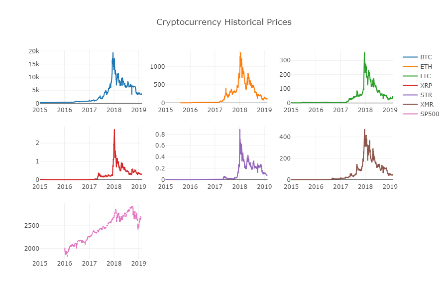
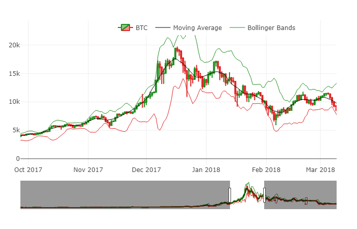
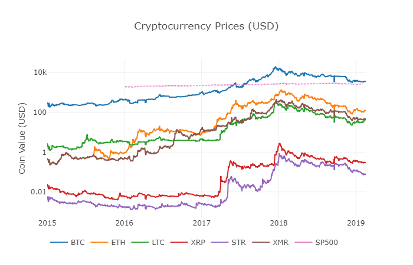
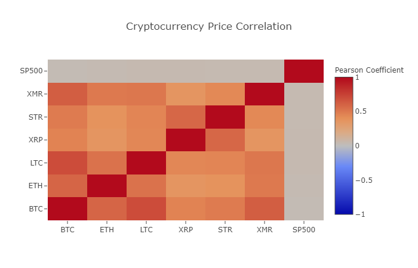
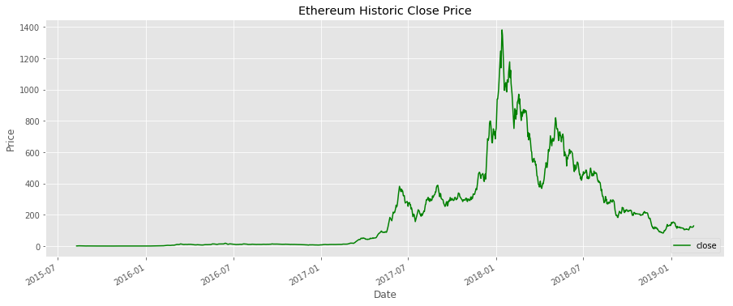
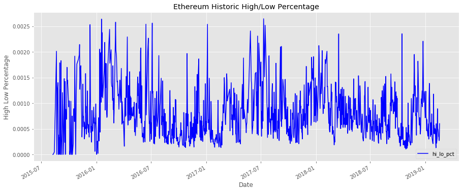
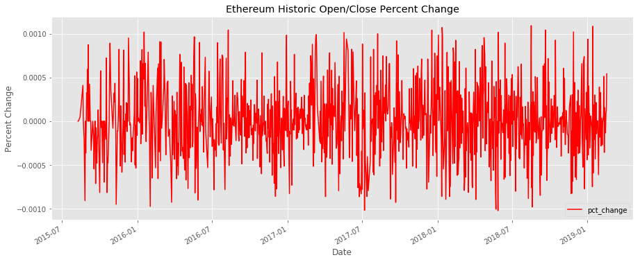
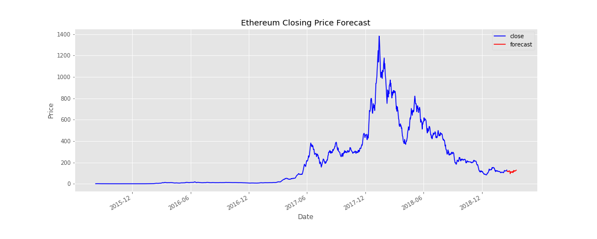
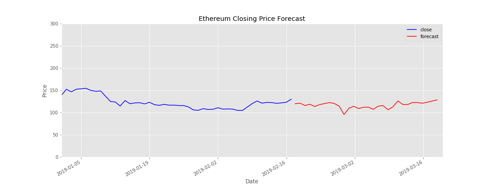
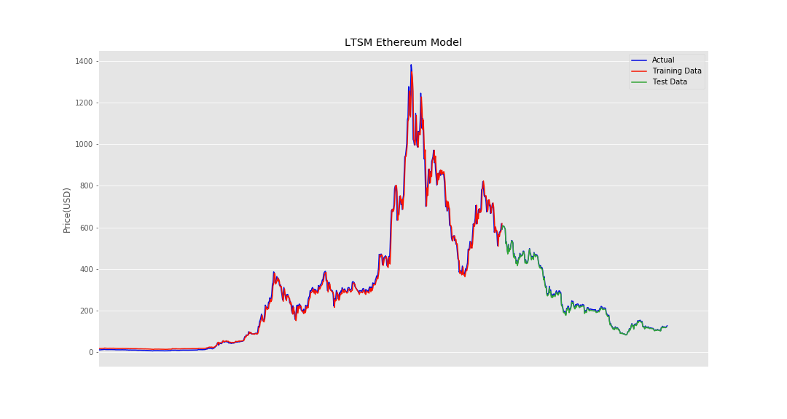

# Crypto_ML
To develop a machine learning model to forecast future prices of Cryptocurrencies
____________________________________________________________________________________

## Data
Using the Quandl and Poloniex Exchange API to pull a few of the largest cryptocurrencies by marketcap as well as the SP500 index for reference with aim to create visualizatons and get a feel for the data.

A look at Closing Price dating back to 2015

Candlestick Chart with moving average and Bollinger Bands

Overlapping comparison of trend in closing price

Correlation between asset closing price

## Linear Regression
The first attempt at predicting future price was with a linear regression model taking just the historic closing price data as the input. Using Ethereum as the asset of choice, again plot and add some new features to use in future predictions

## LSTM

