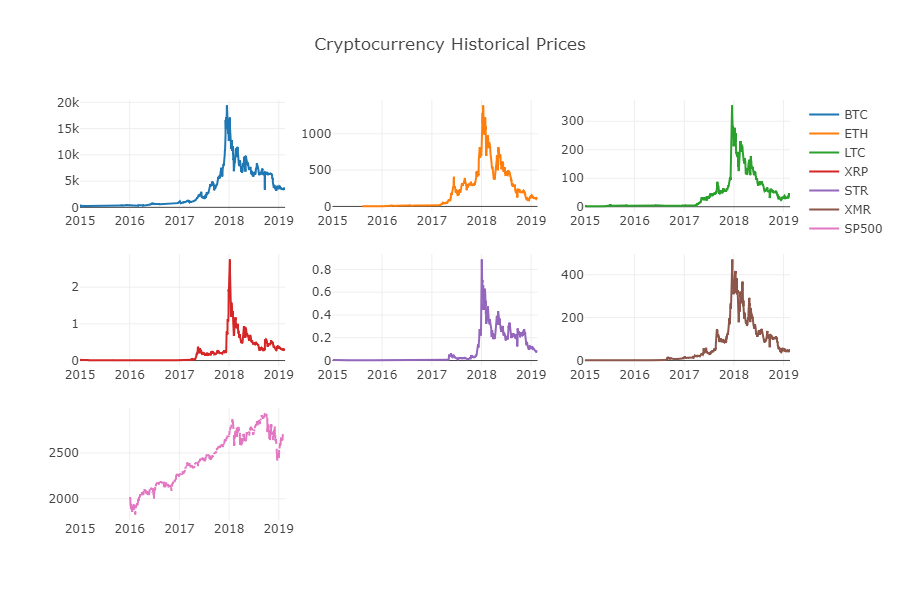
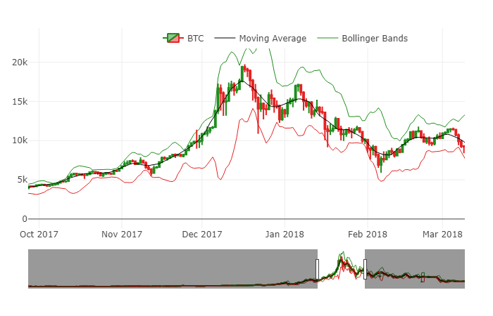
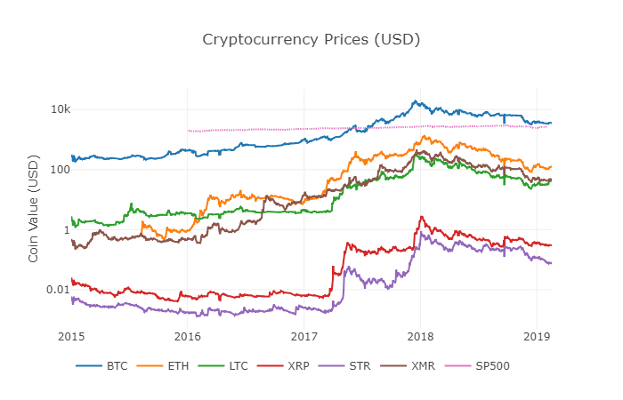
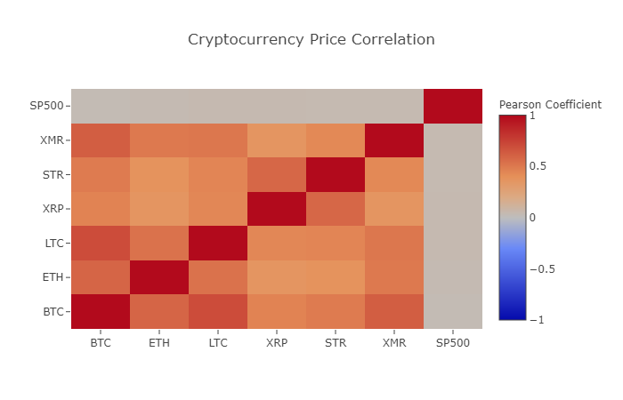

# Crypto_ML
To develop a machine learning model to forecast future Ethereum price
____________________________________________________________________________________

## Data
Using the Quandl and Poloniex Exchange API to pull a few of the largest cryptocurrencies by marketcap as well as the SP500 index for reference with aim to create visualizatons and get a feel for the data.

A look at Closing Price dating back to 2015

Candlestick Chart with moving average and Bollinger Bands

Overlapping comparison of trend in closing price

Correlation between asset closing price

## Linear Regression
## LSTM
